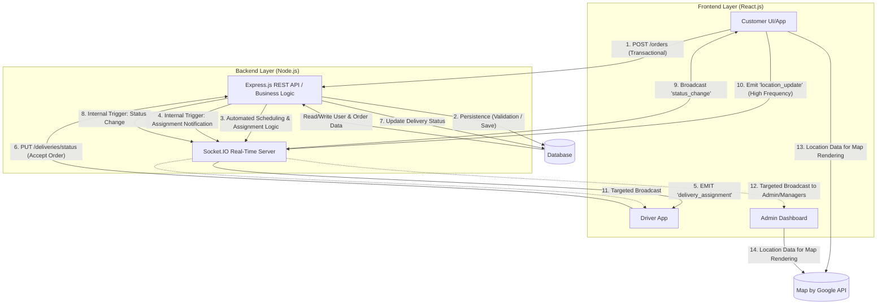

# Delivery Management System

A full-stack **Delivery Management System** that allows businesses to manage, track, and dispatch deliveries efficiently.  
This project is divided into two main parts:
- **Frontend** — the client-facing web interface  
- **Backend** — the RESTful API and database management system  

---

## Table of Contents
- [Introduction](#introduction)
- [Features](#-features)
- [Architecture](#architecture)
- [Tech Stack](#tech-stack)
- [Installation](#installation)
  - [Backend Setup](#backend-setup)
  - [Frontend Setup](#frontend-setup)
- [Usage](#usage)
---

## Introduction

The **Delivery Management System (DMS)** simplifies the process of order creation, driver assignment, and delivery tracking for logistics, e-commerce, or courier companies.  
Admins can manage deliveries, drivers, and customers through a clean web interface.

---

## Features

- **User Roles:** Admins, Dispatchers, Drivers  
- **Order Management:** Create, assign, and track delivery orders  
- **Driver Assignment:** Allocate deliveries to drivers  
- **Status Tracking:** Update and view order statuses (Pending, In Transit, Delivered)  
- **Dashboard:** Overview of active and completed deliveries  
- **Authentication:** Secure login and JWT-based authorization  
- **API Integration:** RESTful API for frontend-backend communication  

---

## Architecture


---

## Tech Stack

### Frontend
- React.js 
- Axios for API requests
-  Tailwind CSS
### Backend
- Node.js + Express.js
- MySQL
- JWT Authentication
- dotenv for environment configuration

---

## ⚙️ Installation

### Prerequisites
Ensure you have installed:
- [Node.js](https://nodejs.org/) (v14 or above)
- npm or yarn
- A database (MySQL)
- Git

---

## Backend Setup


### Clone the repository
```bash
git clone https://github.com/Muhammed-Adnaan/Delivery-Management-System.git

cd Delivery-Management-System/backend
```
### Install dependencies
```bash
npm install
```
### Create environment file
```bash
cp .env.example .env
```
### Update .env with database credentials and JWT secret

### Start backend server
```bash
npm start
```
### or for development
```bash
npm run dev

```
## Frontend Setup
```bash
cd ../frontend
```
### Install dependencies
```bash
npm install
```
### Create environment file
```bash
cp .env.example .env
```
### Update .env with backend API URL (e.g. http://localhost:5000)

### Start frontend
```bash
npm start
```

## Usage

- Run backend and frontend concurrently.
- Register or log in as an Admin.
- Add drivers and customers.
- Create a delivery order and assign it to a driver.
- Update delivery status (Pending → In Transit → Delivered).
- View analytics and delivery history in the dashboard.

